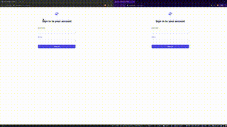

# Simple chat application built using Go, Templ and HTMX

This is a simple chat application built using Go, Templ and HTMX. It is a simple chat application that allows users to send messages to each other in real-time.
It is a proof of concept of what you can do with Go, Templ and HTMX.

I am using the WebSockets extension of HTMX to send and receive messages and update chat status in real-time.

